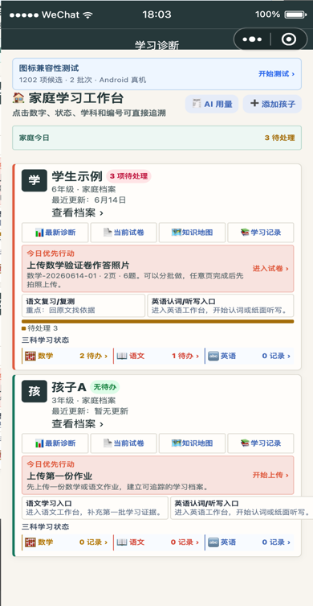
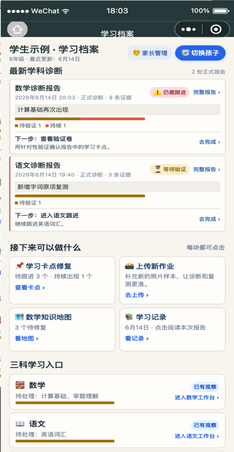
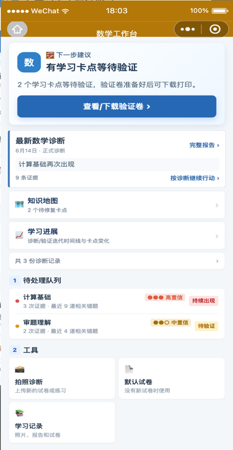
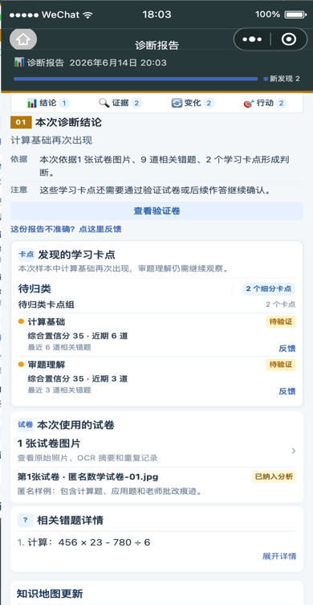
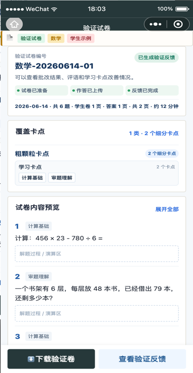

# Learning Diagnostic MVP 产品设计文档（PRD）

> 版本：v3.2 | 日期：2026-08-01 | 状态：私有内测持续迭代；数学节点掌握六态与微验证、语文具体错项复测、英语词汇双维闭环均已落地。常规自动化测试 1089/1089 通过，JS 语法检查 342 个文件通过，主包 809 KB/1200 KB；本周期 15 个业务云函数已确认部署，真机主流程验收无重大问题，DevTools E2E 全套通过并刷新 14 张用户导览图
>
> 历史版本：v2.9（2026-07-02，638 测试基线）

---

## 1. 产品定位

**一句话**：帮助家长用手机拍试卷照片，5 分钟拿到孩子的学习卡点诊断报告。

**目标用户**：小学孩子的家长（主操作者），孩子是被诊断对象。

**核心假设**：学习中的卡点可以被发现、定位、改善和复测。

**MVP 成功标准**：一个不懂教育、不懂技术的家长，能独立完成「看懂孩子学习档案 → 上传试卷 → 拿到报告 → 生成验证试卷」这条完整链路，且能理解当前结论来自哪些样本。

### 关键界面截图

以下截图由自动化脚本使用匿名 mock 数据生成，只用于说明当前产品形态，不包含真实学生资料。

| 场景 | 截图 |
|---|---|
| 家庭学习工作台 |  |
| 个人学习档案 |  |
| 学科工作台 |  |
| 诊断报告 |  |
| 验证试卷预览 |  |

---

## 2. 三条诊断路径

```
学科主页（三个入口）
  │
  ├─ 路径 A：拍照诊断
  │   上传已有试卷照片 → AI 异步分析 → 页面状态刷新 → 查看诊断报告
  │
  ├─ 路径 B：验证试卷
  │   选历史卡点 → AI 生成验证试卷(A4 PDF) → 打印答题 → 拍照上传 → AI 分析 → 验证报告
  │
  └─ 路径 C：默认诊断试卷
      选年级 → AI 生成诊断卷(A4 PDF) → 打印答题 → 拍照上传 → AI 分析 → 诊断报告
```

---

## 3. 页面设计（当前 app.json 注册 26 页，以下按业务页面组说明）

### Page 1：首页 / 家庭学习工作台

**路由**：`pages/index/index`

| 区域 | 内容 |
|------|------|
| 空态 | 没有孩子档案时显示添加第一个孩子 |
| 单孩子 | 直接进入该孩子学习档案，不额外显示家庭工作台 |
| 多孩子 | 显示高密度家庭学习工作台：家庭行动总览、孩子待办、今日优先行动、三科学习状态和快捷入口 |
| 交互原则 | 卡片内的图示、状态块、数字、学科块、报告和试卷入口都可点击，直接进入对应列表、学科页、报告页或试卷页 |

**交互**：点击孩子卡片主体 → 进入 Page 1A；点击具体状态块 → 进入对应筛选后的学习记录或学科工作台；点击「添加孩子」→ 跳转 `add-student` 页。

**实现状态**：✅ 已上线。多孩子模式由 `child-workbench.js` 生成家庭行动总览和孩子行动卡；单孩子模式复用个人学习工作台视图。

### Page 1A：单孩子学习档案

**路由**：`pages/student-profile/student-profile`

| 区域 | 内容 |
|------|------|
| 顶部 | 孩子姓名、年级、家长管理、返回首页 |
| 个人行动摘要 | 单孩子学习档案综合摘要，点击进入今日主行动 |
| 今日行动 | 生成验证卷、上传新试卷或查看学习记录 |
| 最新报告 | 透出最新诊断报告的生成时间、证据时间、主要结论、照片数、相关错题数和阅读完整报告入口 |
| 行动队列 | 学习卡点、上传新作业、数学知识地图、学习记录 |
| 学科入口 | 数学/语文/英语三科入口，进入单学科工作台 |

**交互**：点击个人行动摘要/今日行动 → 当前主任务；点击最新报告 → Page 6；点击卡点/知识地图/学习记录 → 对应工具页；点击学科 → Page 3；点击家长管理 → Page 5A。个人页不再重复堆叠样本覆盖、指标条和最近记录列表。

---

### Page 2：（已移除）

原 `pages/subject-select/subject-select` 学科入口页已从当前 `app.json` 移除。首页、个人学习档案和家庭工作台现在直接提供数学/语文/英语入口，并跳转到 `pages/subject-home/subject-home`。首次进入某学科时，由数据层和云函数保证学科档案可读取或创建。

---

### Page 3：学科主页（学科工作台）

**路由**：`pages/subject-home/subject-home`

| 区域 | 内容 |
|------|------|
| 顶部 | 返回箭头 + "数学工作台" + 学生名和年级 |
| 当前任务 | 根据学科档案生成主任务：生成验证试卷 / 拍照诊断 |
| 待处理队列 | 只展示可执行的短名称、状态和证据数量，如“计算基础 · 相关错题 3” |
| 工具入口 | 拍照诊断、默认试卷、学习记录、完整报告 |
| 分析中卡片 | 如有正在分析的任务，显示轻量状态和批次文字，不显示伪进度条 |

> 新版体验：学科主页不再重复展示“当前综合诊断 / 最近变化 / 大段学习卡点解释”，只回答“这个学科现在该做什么”。完整解释留在首页综合摘要和报告页。

**交互**：
- 点主任务 → 根据 `primaryTask.actionType` 进入 Page 4 或 Page 7
- 点待处理队列项 → 进入 Page 7，并预选该学习卡点
- 点工具入口 → 进入拍照诊断 / 默认试卷 / 学习记录 / 完整报告
- 点"分析中"卡片 → 显示当前分析进度

**设计决策**：
- 不使用 Tab 切换；学科页采用工作台结构，主任务优先
- 上传与分析解耦后，学科主页是用户等待分析期间的主要停留页

**实现状态**：✅ 已上线。`subject-home.js` 在 `onShow` 中加载档案与历史记录，`subject-home-presenter.js` 生成 `primaryTask / taskQueue / tools` 工作台视图，并通过 `createPoller()` 每 10 秒轮询当前分析报告。

---

### Page 4：拍照上传页

**路由**：`pages/upload/upload`

| 区域 | 内容 |
|------|------|
| 顶部 | 返回箭头 + 场景标题（由来源页参数决定） |
| 说明条 | 当前场景说明（拍照诊断/验证上传/试卷上传，由 `mode` 参数控制文案） |
| 拍照提示 | 光线充足、试卷铺平、字迹清晰、红笔批注可见 |
| 照片网格 | 4×5 网格，最多 20 张，支持拍照和相册选择，每张可删除 |
| 格式处理 | HEIF/HEIC 图片会尽量自动转为 JPEG；无法转换时给出可读提示并跳过 |
| 上传进度 | 上传中时显示进度条（已上传 X/总数） |
| 异步提示 | "上传完成后即可返回，AI 将在后台分析，完成后推送通知" |
| 底部按钮 | 「上传并开始分析 (N张)」 |

**场景参数**：
- `mode=diagnosis`：拍照诊断（默认），标题"拍照上传试卷"
- `mode=verification`：验证上传，标题"上传验证试卷答题"
- `mode=paper`：试卷上传，标题"上传诊断试卷答题"

**设计决策**：
- 不使用 Tab 切换模式，模式由上一个页面通过 URL 参数决定
- 不预留 Lonsid 智能笔 UI，MVP 只做拍照上传
- 上传完成后立即返回 Page 3，触发云函数异步分析
- 去掉"AI 分析中"独立页面，改为在 Page 3 显示分析状态
- 历史中出现同名文件时只做轻提示，不阻止上传；最终由 OCR 摘要判断是否疑似重复

**实现状态**：✅ 已上线。`upload.js` 逐张调用 `wx.cloud.uploadFile()`，再调用 `callUploadAndAnalyze()` 创建报告并启动后台分析；服务端启动成功后客户端即可返回学科主页。

### Page 4A：学习记录页

**路由**：`pages/upload-history/upload-history`

按“天”组织孩子的学习过程，聚合当天发生的诊断报告、生成的验证试卷、验证试卷作答后的上传批复记录，以及对应的原始照片、OCR 摘要和疑似重复标记。用户可以从单日时间线进入报告或试卷预览，也可以预览当天上传过的原始照片。

疑似重复照片仍保留在学习记录中，但不重复计入诊断报告的错题和学习卡点统计。若一次上传全部为疑似重复照片，本次记录不更新学习卡点或改善结论。旧报告没有 OCR 摘要时，仍展示原始照片。

**实现状态**：✅ 已上线。`upload-history.js` 通过 `cloud.getReports()`、`cloud.getPapers()` 与 `cloud.getTempFileURLs()` 构建按天分组的学习记录；缺临时 URL 时降级提示，加载失败会清除 loading 标志。

---

### Page 5：（已移除）

原来的"AI 分析中"独立页面已移除。上传完成后用户直接返回 Page 3，分析结果通过轻量轮询和全局状态刷新回到页面；微信订阅消息发送链路尚未实现。

---

### Page 6：诊断/验证报告页

**路由**：`pages/report/report`

| 区域 | 内容 |
|------|------|
| 顶部 | 报告类型、日期、本次结论摘要 |
| 区块 A | **本次诊断结论**：一句话结论 + 错题/卡点/图片数量 |
| 区块 B | **发现的学习卡点**：卡点原因、状态和相关错题数 |
| 区块 C | **本次使用的试卷**：进入学习记录查看原始照片、OCR 摘要和重复记录 |
| 区块 D | **相关错题详情**：折叠列表，点击展开查看答案与根因分析 |
| 下一步 | 有待验证卡点时，显示“生成验证试卷”主操作 |
| 底部 | 分享报告 + 下载 PDF |

**报告类型**：
- 诊断报告：首次发现卡点，`type=diagnosis`
- 验证报告：通过完整验证证据更新卡点状态，`type=verification`

**验证报告特有**：
- 家长侧统一显示三种状态：需要验证 / 持续出现 / 已有改善
- 只有全部预期验证题均被清晰识别为已作答且全部正确，才确认“已有改善”

**实现状态**：✅ 已完成。`report.js` 使用 `report-presenter.buildReportView()` 生成直接可读的结论、卡点状态和错题展开视图；分析中会启动轮询，任务缺失时显示“重新启动分析”按钮（`onRetryAnalysis`）。PDF 下载走 `callGenerateReportPDF()` → `wx.cloud.downloadFile` → `wx.openDocument`。

> 新版报告正文在小程序内直接展示“本次诊断结论 / 发现的学习卡点 / 本次使用的试卷”，PDF 仅作为下载与打印能力。

---

### Page 7：验证试卷生成页

**路由**：`pages/generate-verification/generate-verification`

| 区域 | 内容 |
|------|------|
| 顶部 | 出卷配置 + 学科纸质验证卷说明 |
| 试卷配置 | 出题范围摘要、卡点数、题目总数、预估时间、A4 页数 |
| 出题范围 | 待验证卡点勾选列表，每个显示短名称、上次发现日期、优先级标签；内部 LP 编号不直接暴露 |
| 底部 | 「预览 PDF」 + 「生成 A4 试卷」 |

**逻辑**：
- 从学科工作台点击单个卡点进入时，默认只选该卡点
- 其他入口默认按严重度优先选中最多 5 个卡点
- 最低选 1 个卡点，最多选 5 个
- 每个卡点默认生成 5 道题：3 道核心验证题 + 2 道迁移延展题
- 点击「生成试卷」→ AI 根据卡点 + 年级生成题目 → 生成 A4 PDF → 跳转 Page 9

**实现状态**：✅ 已上线。`generate-verification.js` 限制最多 5 个卡点，支持 `targetCode` 预选，实时生成 `paperConfig`；预览模式调用 `callGeneratePaper({ preview: true })` 直接跳转预览页，正式生成后再写库。

---

### Page 8：默认诊断试卷选择页

**路由**：`pages/default-paper/default-paper`

| 区域 | 内容 |
|------|------|
| 顶部 | 返回箭头 + "默认诊断试卷" |
| 说明 | 没有现成试卷？选一套标准题来做诊断 |
| 年级选择 | 一年级～六年级 标签组 |
| 试卷列表 | 每个年级 2 套试卷（A/B 卷），显示：覆盖卡点、题目数、预估时间、A4 页数 |
| 底部提示 | "建议先打印让孩子在纸上作答，完成后拍照上传" |
| 试卷操作 | 每套试卷：「预览 PDF」+ 「使用这套试卷」 |

**逻辑**：
- 点击「使用这套试卷」→ 如尚未生成则 AI 动态生成 → 生成 A4 PDF → 跳转 Page 9
- 默认试卷由 AI 根据年级 + 常见卡点动态生成，不预存题库
- 同一套试卷的题目模板固定（通过 prompt seed 控制），保证一致性

**实现状态**：✅ 已上线。`default-paper.js` 内置 `PAPER_CONFIG`（1-6 年级各 A/B 卷），先按 `(studentId, subject, type=default-diagnosis, grade, paperKey)` 查询缓存；命中则直接跳预览页，未命中再调云函数生成。跨学生共享模板尚未实现。

---

### Page 9：试卷预览/打印页

**路由**：`pages/paper-preview/paper-preview`

| 区域 | 内容 |
|------|------|
| 顶部 | 返回箭头 + "试卷预览" + 页码 |
| 试卷标签 | 类型标签（验证试卷/诊断试卷）+ 学科 + 学生名 |
| A4 预览区 | 缩略图展示 A4 试卷内容，按卡点分组排列题目 |
| 操作按钮 | 「下载 PDF」/「已下载」+ 「分享打印」 |
| 主按钮 | 「作答完成，拍照上传」→ 跳转 Page 4（mode=verification 或 paper） |

**实现状态**：✅ 已上线。`paper-preview.js` 同时支持 `paperId` 模式（正式试卷，可下载 + 上传答题）和 `fileId` 预览模式（临时文件，仅预览）。下载走 `wx.cloud.downloadFile` + `wx.openDocument({ showMenu: true })`；同一份 PDF 下载后在本地记录并显示「已下载」，避免重复下载；上传按钮根据试卷类型切换 mode。

---

## 4. 数据模型

### 4.1 students 集合

```javascript
{
  _id: String,          // 自动生成
  _openid: String,      // 用户 openID
  name: String,         // 学生姓名（≤30 字）
  grade: Number,        // 年级 (1-6)
  avatarColor: String,  // 头像颜色（前端按姓名 hash 计算）
  reportCount: Number,  // 历史报告计数（addStudent 初始化为 0，由业务逻辑维护）
  createdAt: Date,
  updatedAt: Date
}
```

> 实现备注：`cloud.createStudentWithProfiles()` 会同步创建该学生的三条学科档案。

### 4.2 subjectProfiles 集合

```javascript
{
  _id: String,
  _openid: String,
  studentId: String,    // 关联学生
  subject: String,      // 'math' | 'chinese' | 'english'
  subjectName: String,  // '数学' | '语文' | '英语'（冗余中文名称，便于前端展示）
  totalReports: Number, // 历史报告总数（由 analyzePhotos 使用 _.inc(1) 累加）
  pendingBottlenecks: [ // 待验证卡点
    {
      lpCode: String,   // 'LP-003'
      lpName: String,   // '分数运算'
      severity: String, // 'high' | 'medium' | 'low'
      sinceDate: Date   // 首次发现日期
    }
  ],
  improvedBottlenecks: [ // 已改善卡点
    {
      lpCode: String,
      lpName: String,
      improvedDate: Date
    }
  ],
  currentAnalysisId: String, // 当前正在分析的 reportId（空串表示无）
  analysisStatus: String,    // 'analyzing' | ''（空字符串表示空闲）
  createdAt: Date,
  updatedAt: Date
}
```

> 实现备注：`ensureSubjectProfile()` 保证幂等创建；分析完成或失败时 `clearSubjectProfileAnalysis()` 会清空状态。

### 4.3 reports 集合

```javascript
{
  _id: String,
  _openid: String,
  studentId: String,
  studentName: String,     // 冗余学生姓名，便于报告展示与 PDF 生成
  subject: String,
  type: String,           // 'diagnosis' | 'verification'
  sourceType: String,     // 'photo' | 'paper' | 'default-paper'
  status: String,         // 'analyzing' | 'completed' | 'failed'
  imageFileIds: [String], // 云存储文件 ID 列表
  imageFiles: [{          // 每张照片的历史与 OCR 去重信息
    fileID: String,
    fileName: String,
    fileSize: Number,
    ocrSummary: String,        // AI 返回的 OCR 摘要（≤1000 字）
    contentFingerprint: String,// 归一化后的指纹，用于跨批次/跨报告去重
    isDuplicate: Boolean,      // true 表示与历史或本次其他照片重复
    duplicateOf: String        // 首次出现该指纹的 fileID
  }],
  paperId: String,        // 关联的试卷 ID（验证/默认试卷上传时有值）
  
  // 分析结果
  summary: String,        // 一句话总结
  totalErrors: Number,    // 错题总数（已去除重复页面）
  bottlenecks: [
    {
      lpCode: String,
      lpName: String,
      errorCount: Number,
      severity: String,     // 'high' | 'medium' | 'low'
      status: String,       // 'found' | 'improved' | 'worsened' | 'new' | 'persisting'
      rootCause: String,    // AI 给出的根因假设
      suggestion: String    // 修复建议
    }
  ],
  errorDetails: [
    {
      questionContent: String,  // 题目内容
      studentAnswer: String,    // 学生答案
      correctAnswer: String,    // 正确答案
      lpCode: String,           // 关联卡点
      rootCause: String,        // 根因
      suggestion: String        // 改进建议
    }
  ],
  
  // 验证报告对比
  previousReportId: String,    // 对比的上一份报告 ID
  comparisonSummary: String,   // 对比总结
  
  pdfFileId: String,           // 由 generateReportPDF 写入的报告 PDF fileID
  error: String,               // status='failed' 时记录错误原因
  completedAt: Date,
  createdAt: Date,
  updatedAt: Date
}
```

> 实现备注：`uploadAndAnalyze` 创建初始记录（status=analyzing），`analyzePhotos` 完成后覆盖字段；全部照片疑似重复时仅更新 `summary/comparisonSummary`，不修改 `bottlenecks/errorDetails`。

### 4.4 papers 集合（试卷）

```javascript
{
  _id: String,
  _openid: String,
  studentId: String,
  subject: String,
  type: String,           // 'verification' | 'default-diagnosis'
  grade: Number,
  paperKey: String,       // 默认试卷套题标识（如 'grade3_a'），验证试卷为空串
  bottleneckTargets: [String], // 覆盖的 LP 编号列表
  questions: [
    {
      index: Number,
      lpCode: String,
      lpName: String,     // AI 返回的卡点名称
      content: String,      // 题目内容
      answer: String,        // 参考答案（不显示在试卷上）
      points: Number
    }
  ],
  pdfFileId: String,       // 生成的 PDF 云存储 ID
  totalPages: Number,      // 按每页 6 题估算
  createdAt: Date
}
```

> 实现备注：`generatePaper` 支持 `preview=true` 仅生成临时 PDF，不落库；正式生成才写入集合。

### 4.5 analysisTasks 集合（异步任务追踪）

```javascript
{
  _id: String,
  _openid: String,
  reportId: String,          // 关联的报告 ID
  totalBatches: Number,      // 总批次数
  completedBatches: Number,  // 已完成批次数
  status: String,            // 'processing' | 'completed' | 'failed'
  fileIDs: [String],         // 所有图片文件 ID（字段名为 fileIDs，与 reports.imageFileIds 区分）
  mode: String,              // 'diagnosis' | 'verification'
  subject: String,
  studentId: String,
  error: String,             // status='failed' 时记录错误原因
  createdAt: Date,
  completedAt: Date
}
```

> 实现备注：`analyzePhotos` 在启动时会清理超过 10 分钟的陈旧 `processing` 任务并允许重新启动；同一报告可存在多条 task 记录，按 `createdAt` 倒序取最新。

---

## 5. 异步分析架构

### 核心原则：服务端可靠触发 + 前端立即返回

```
用户拍照上传 → 云存储 → uploadAndAnalyze 创建报告并启动后台分析
                       → 服务端创建报告并 fire-and-forget 启动 analyzePhotos
                       → 客户端提交成功后返回学科主页
                       → analyzePhotos 完成分批分析与落库
                       → 前端轮询报告状态直到 completed/failed
```

> **当前实现说明**：`uploadAndAnalyze` 不等待 `analyzePhotos` 完成，而是在服务端发起后台分析后立即返回 `reportId`。云函数超时保持在微信平台允许的 60 秒以内，长批次通过任务进度、轮询和手动重试恢复。

### 流程详解

1. **上传阶段**（Page 4）
   - 用户选择照片 → 逐张上传到云存储 → 获得 fileID 列表
   - 上传进度实时显示
   - 全部上传完成 → 调用 `uploadAndAnalyze` → 服务端校验内测授权、学生权限、上传模式和 `paperId` 关联 → 创建 `reports` + 启动 `analyzePhotos` → 客户端成功后返回 Page 3

2. **分析阶段**（云函数，后台执行）
   - `analyzePhotos` 读取报告 → 按 5 张/批拆分 → 串行调用 `analyzeBatch`
   - 每批完成后写入 `analysisTasks.completedBatches`
   - 全部批次完成 → `markDuplicatePages()` 标记疑似重复页面 → 仅对唯一页面做合并
   - 验证模式额外调用 `compareBottlenecks()` 与上一份已完成报告对比
   - 更新 `reports`、`subjectProfiles`、`analysisTasks`

3. **通知阶段**
   - `sendNotification()` 当前为空实现（仅记录日志），待申请微信订阅消息模板后补全
   - 用户在 Page 3 / Page 6 的轮询中看到状态变为"查看报告"

### 云函数设计

```
cloudfunctions/
  uploadAndAnalyze/    # 入口：校验参数、创建 reports、更新 subjectProfiles、fire-and-forget 启动 analyzePhotos
  analyzePhotos/       # 主控：拆分批次、串行调用 analyzeBatch、去重、合并、对比、落库
  analyzeBatch/        # 单图分析，调 CloudBase AI qwen3.5-plus，返回结构化 pageResults
  getAnalysisProgress/ # 轻量查询 analysisTasks 进度
  generatePaper/       # 生成验证/默认试卷题目 + A4 PDF（支持 preview 模式）
  generateReportPDF/   # 生成报告 PDF，回写 reports.pdfFileId
```

> 体验版内测说明：真实上传能力需要先同意内测授权。上传页会展示授权弹层，`uploadAndAnalyze` 服务端也会校验 `userConsents.betaConsented=true`，避免老客户端或直接云函数调用绕过授权。AI 用量账本由 `aiUsage` 云函数和各 AI 云函数的 `usage-ledger.js` 副本记录，账单页只展示内测成本估算，不代表应付款项。

---

## 6. 默认诊断试卷的 AI 生成策略

### 生成流程

1. 用户选择年级 → 选择 A/B 卷
2. 云函数 `generatePaper` 调用混元 API，prompt 包含：
   - 年级信息
   - 该年级对应的常见卡点列表（预设 4-6 个）
   - A/B 卷的题型偏好（A 卷偏计算应用，B 卷偏推理建模）
   - 题目格式要求（填空题为主，标注卡点编码）
3. AI 返回结构化题目列表 → 存入 `papers` 集合
4. 用 `pdfkit` 或类似库生成 A4 PDF → 上传云存储

### 一致性保证

- 同一年级同一套试卷（如"三年级 A 卷"），prompt 模板固定
- 生成后缓存 PDF，同一学生重复请求不重新生成
- 不同学生请求同一套试卷，可复用已缓存的 PDF

---

## 7. 页面路由配置

```json
{
  "pages": [
    "pages/index/index",
    "pages/student-profile/student-profile",
    "pages/add-student/add-student",
    "pages/subject-home/subject-home",
    "pages/upload/upload",
    "pages/upload-history/upload-history",
    "pages/report/report",
    "pages/learning-progress/learning-progress"
  ],
  "subPackages": [
    "bottleneck-center", "bottleneck-detail", "knowledge-map", "micro-validation",
    "english-practice", "english-dictation", "english-wrong-words", "english-confusion",
    "chinese-review-detail", "chinese-skill-task", "learning-resource",
    "generate-verification", "default-paper", "paper-preview",
    "parent-management", "join-student", "ai-usage", "icon-compatibility"
  ]
}
```

共 26 个注册页面（主包 8 + 分包 18）。`app.json` 中已按上述顺序注册。

---

## 8. MVP 功能优先级

### P0（必须上线）

| 功能 | 页面 | 说明 |
|------|------|------|
| 家庭工作台 / 学习档案 | Page 1 / Page 1A | 多孩子显示家庭工作台，单孩子直接进入学习档案 |
| 学生与家长管理 | Page 1 / Page 5A / Page 5B | 添加孩子、邀请共同家长、扫码加入孩子档案 |
| 学科入口 | Page 1 / Page 1A / Page 3 | 首页和个人档案直接进入学科工作台；原 Page 2 学科选择页已下线 |
| 拍照诊断 | Page 3→4 | 上传→异步分析→报告 |
| 诊断报告 | Page 6 | 卡点排行 + 错题详情 |
| 验证试卷生成 | Page 3→7→9 | 配置出题范围→生成 PDF→打印 |
| 默认诊断试卷 | Page 3→8→9 | 选年级→生成 PDF→打印 |
| 异步分析 + 推送 | 云函数 | 核心技术架构 |

### P1（第二批迭代）

| 功能 | 说明 |
|------|------|
| 报告趋势对比 | 多次报告的卡点变化趋势图 |
| 报告分享图 | 生成长图分享到家长群 |
| 语文/英语卡点体系 | 独立于数学的 bug-taxonomy |
| Lonsid 智能笔集成 | 蓝牙连接 + 笔迹数据同步 |
| 家长仪表盘 | 跨学科、跨时间的全局视图 |

---

## 9. 关键设计决策记录

| 决策 | 选择 | 理由 |
|------|------|------|
| 上传模式切换 | 不用 Tab，由来源页参数决定 | 减少用户选择负担，模式由上下文隐含 |
| Lonsid 智能笔 | MVP 不做，不预留 UI | 避免未完成功能干扰用户，减少开发量 |
| 默认试卷来源 | AI 动态生成 | 无需维护题库，灵活适配各年级 |
| 上传与分析 | 服务端可靠触发 + 前端立即返回 | `uploadAndAnalyze` 创建报告后 fire-and-forget 启动 `analyzePhotos`；长批次由后台函数完成 |
| 分析进度展示 | 在学科主页显示状态，不用独立页面 | 减少页面数，用户可在等待期间浏览其他内容 |
| 通知方式 | 微信订阅消息推送 | 合规且用户触达率高 |
| 登录方式 | wx.login() 静默获取 openID | 零摩擦，无需注册登录页 |
| 数据隔离 | 云数据库安全规则，按 openID 读写 | 一行规则解决多用户数据隔离 |

---

## 10. MVP 实现状态总览（2026-07-18）

| 能力 | 状态 | 备注 |
|------|------|------|
| 26 个页面 + 四件套文件 | ✅ | `deployment-readiness.test.js` 校验 |
| 家庭工作台 + 个人学习工作台 | ✅ | `index` 处理 0/1/多孩子分流；多孩子显示家庭行动总览和孩子行动卡，单孩子与 `student-profile` 共享个人工作台 |
| 家长成员管理 | ✅ | owner 可邀请/移除共同家长，viewer 除成员管理外可参与学习流程 |
| 添加学生并同步创建三条学科档案 | ✅ | `cloud.createStudentWithProfiles()` |
| 学科隔离与学科工作台 | ✅ | `subject-home-presenter.js` 生成 primaryTask、taskQueue、tools |
| 最多 20 张照片上传 + 同名软提示 + HEIF 处理 | ✅ | `upload.js` |
| 服务端可靠触发分析 + 前端立即返回 | ✅ | `uploadAndAnalyze/index.js` |
| 5 张/批串行分析 + 进度写入 analysisTasks | ✅ | `analyzePhotos/index.js` |
| AI 结果标准化（字段截断、严重度归一） | ✅ | `analyzeBatch/result-normalizer.js` |
| OCR 摘要去重（跨批次 + 跨历史报告） | ✅ | `analyzePhotos/photo-dedup.js` |
| 全部照片重复时不更新卡点 | ✅ | `analyzePhotos` uniquePages.length === 0 分支 |
| 验证报告对比（improved/worsened/new/persisting） | ✅ | `analyzePhotos/comparison.js` |
| 学科主页 / 报告页轮询分析状态 | ✅ | `utils/poller.js`，每 10s，最多 30 次 |
| 分析任务缺失时手动重试 | ✅ | `report.onRetryAnalysis()` |
| 验证试卷出卷配置（≤5 卡点 × 5 题） | ✅ | 每个卡点 3 道核心验证题 + 2 道迁移延展题，支持 targetCode 预选和 paperConfig |
| 默认诊断试卷（1-6 年级 A/B 卷 + 同学生缓存） | ✅ | `default-paper.js` + `generatePaper` paperKey 查询 |
| 报告 PDF 生成与下载 | ✅ | `generateReportPDF/index.js` + `report.onDownloadPDF()` |
| 试卷预览/打印/分享 | ✅ | `paper-preview.js` 支持 paperId 与 fileId 两种模式，并记录已下载状态 |
| 学习记录时间线 + 原图预览 | ✅ | `upload-history.js` 按天聚合报告、试卷、验证上传和照片 |
| 学习卡点中心 + 单卡点工作台 | ✅ | `bottleneck-center` / `bottleneck-detail` 基于共享 `BottleneckView` 展示卡点、证据链和验证入口 |
| 英语个人词库 + 认词练习 + 纸面听写 + 错词本 | ✅ | `englishVocabulary` + `english-practice` / `english-dictation` / `english-wrong-words`，只做词汇掌握和书面证据闭环 |
| AI 用量账本、内测授权和数据删除请求 | ✅ | `aiUsage` 云函数 + `pages/ai-usage/ai-usage`，首页和上传页接入授权/账单入口 |
| 学习卡点短名称展示 | ✅ | `utils/util.js` 将 LP 编号转为家长可读的短摘要，如“小数分数”“单位换算” |
| Skill / CLI P0 | ✅ | `services/skills` 与 `cli/ldx.js` 封装诊断、报告、卡点、验证卷、反馈和时间线能力 |
| 数据归属校验（openID）+ 参数白名单 | ✅ | 各云函数入口 |
| 自动化测试覆盖（1089 个默认离线用例全绿） | ✅ | `npm test`；真实图片、真实云按需单独运行 |
| DevTools E2E | ✅ | 核心 23/23、数学 4/4 + 10/10、语文 3/3、英语 7/7、家庭密度与上传历史布局通过 |
| JS 语法检查 | ✅ | `npm run check`（342 个文件） |
| 主包体积预算 | ✅ | `npm run check:size`（809 KB / 1200 KB） |
| 微信订阅消息推送 | ⚠️ | `sendNotification()` 仍为空实现，待申请模板 |
| 上传与分析解耦 | ✅ | `uploadAndAnalyze` 不等待 `analyzePhotos` 完成 |
| 默认试卷跨学生共享模板 | ⚠️ | 仅同学生复用 |
| 验证结论区分答对/空白/OCR 漏识别 | ⚠️ | 当前按"未识别出错题"判定改善 |
| 真机主流程验收（不含订阅消息） | ✅ | 2026-08-01 项目负责人确认无重大问题；见 SETUP.md 第七章 |
