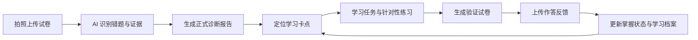
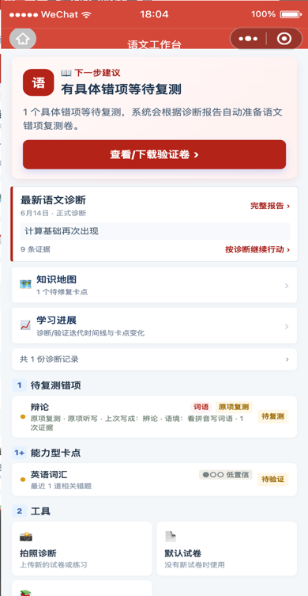
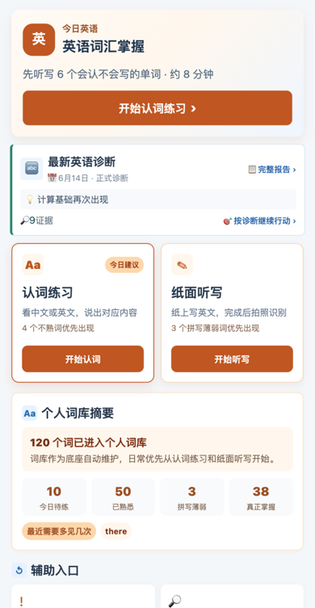
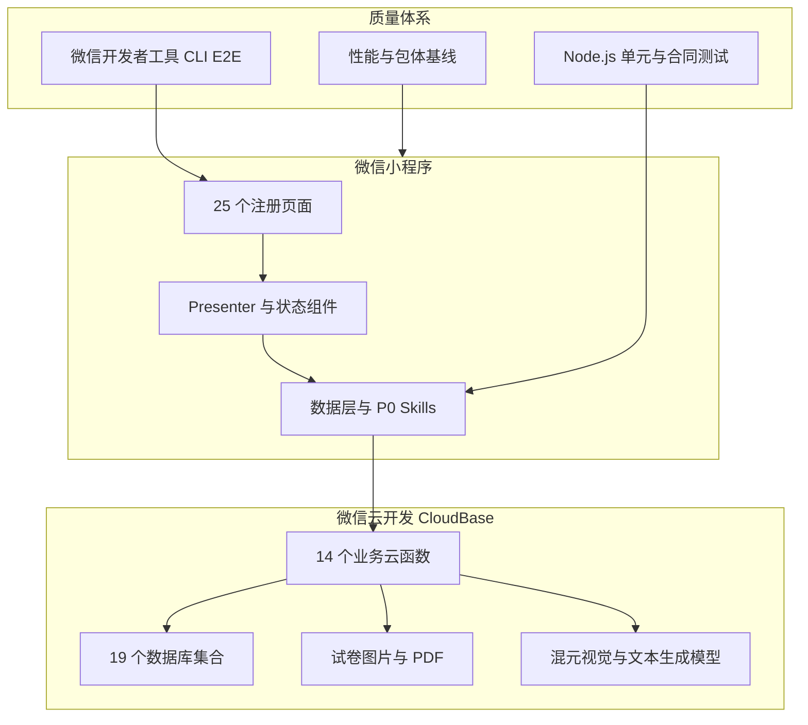

# 学习卡点诊断小程序

<p align="center">
  
</p>

<p align="center">
  <strong>把“这道题做错了”，变成家长看得懂、孩子做得到、结果可验证的下一步行动。</strong>
</p>

<p align="center">
  面向小学家庭的 AI 学习诊断微信小程序。拍照上传试卷后，系统定位学习卡点、生成正式诊断报告，<br />
  再把学习任务、验证试卷和作答反馈串成一条持续改善闭环。
</p>

<p align="center">
  
  
  
  
</p>

<p align="center">
  
  
</p>

> 截图全部由自动化脚本使用匿名 mock 数据生成，不含真实学生姓名、账号、学校、试卷照片、云文件地址或内部编码。完整界面与操作说明见[图文用户导览](docs/user-guide/README.md)。

## 为什么做这个项目

家长看到错题时，通常知道“错了什么”，却不容易判断：这是偶然失误，还是稳定存在的学习卡点？应该先讲知识、做相似题，还是直接复测？过几天以后又该如何确认孩子真的掌握了？

本项目把这些判断变成一套可追踪的产品流程：



产品不止给出一份报告，而是持续回答三个问题：

1. **现在发生了什么**：哪些错误重复出现，证据来自哪里，结论可信到什么程度。
2. **接下来做什么**：优先处理哪个卡点，学习、练习和复测如何衔接。
3. **是否真的改善**：验证结果如何，哪些问题已经改善，哪些仍需观察或再次处理。

## 核心体验

### 家庭学习工作台

家庭首页按孩子组织信息，并把最重要的动作提前：快捷入口、每门学科的最新正式诊断、优先行动、四项学习统计和紧凑学科状态。没有正式诊断的学科不会占据诊断区空间；AI 用量与成本估算只在家庭首页提供统一入口。

<p align="center">
  
  
  
</p>

### 从诊断到验证

报告页把错误证据、学习卡点、出现频次、置信度分数和下一步行动放在同一条阅读路径上。验证卷使用家长可读的“学科 + 日期 + 序号”，内部学习卡点编码和数据库 ID 不会直接透传到界面。

<p align="center">
  
  
  
</p>

## 三个学科，三种诊断逻辑

同一套闭环不能机械套用到所有学科。本项目为数学、语文和英语保留不同的证据模型和行动方式。

| 学科 | 诊断重点 | 下一步行动 | 验证方式 |
| --- | --- | --- | --- |
| **数学** | 错题背后的知识节点、细粒度卡点、出现频次与置信度 | 知识地图、任务包、同类题迁移练习 | 围绕同一卡点生成新的相似题，验证能否举一反三 |
| **语文** | 具体错字、错词、读音、释义等记忆型错项，以及阅读表达能力型卡点 | 原项复习优先，再补充同音、同形、形近或多义迁移 | 必须把原来识别错误的字词再次放入验证卷，同时加入有限迁移题 |
| **英语** | 个人词库中的“会认”和“会写”两条独立掌握状态 | 今日词汇、认词练习、纸面听写、易混词巩固和错词本 | 口头识别与纸面拼写分别留存证据、分别更新状态 |

<p align="center">
  
  
  
</p>

更多学科规则见[学科设计索引](docs/subject-design/README.md)。

## 已实现能力

### 诊断与报告

- 手机拍照或从相册选择试卷，支持批量上传、图片压缩和重复文件轻量检查。
- 云端异步分批分析，页面通过轻量进度接口轮询，超时后可恢复状态。
- 结构化保存错题、OCR 摘要、卡点层级、证据指标、置信度和报告质量。
- 正式报告支持家长纠错反馈，并可生成 PDF。
- 用户界面统一隐藏内部 LP/BN 编码、数据库 ID、云文件地址和后端错误细节。

### 学习与验证

- 数学知识地图覆盖 150 个知识节点，支持卡点层级、资源任务包和掌握状态视图。
- 验证卷按细粒度目标组织，支持多页任务包、打印预览、断点恢复和作答反馈。
- 语文保存具体错项，组卷时先复测原项，再进行受约束的相似迁移。
- 英语提供个人词库、认词练习、纸面听写、错词本、易混词巩固和学习时间线。
- 家庭首页、学习档案和学习记录共同呈现最新结论与可执行行动，避免重复罗列同一信息。

### 家庭与治理

- 一个家长可管理多个孩子，也可通过邀请共同管理同一份学习档案。
- 所有孩子数据读写均经过服务端成员权限校验。
- AI 调用以追加账本记录 token、图片数和估算成本，支持按月汇总。
- 内测授权、数据删除申请、脱敏截图和用户可见编码规则均有独立约束。
- Android 与 iOS emoji 真机结果已固化为[兼容白名单](docs/EMOJI_COMPATIBILITY_WHITELIST.md)，实验页与正式业务调用隔离。

## 工程架构



| 层级 | 主要技术 |
| --- | --- |
| 客户端 | 微信小程序原生 WXML / WXSS / JavaScript，按需注入与 17 个独立分包 |
| 云端 | 微信云开发 CloudBase，14 个业务云函数、云数据库、云存储 |
| AI | `hy3-preview` 多模态识别，`deepseek-v4-flash` 题目与内容生成 |
| 文档与 PDF | pdfkit、内置 Noto CJK 字体、结构化报告与验证卷 |
| 测试 | Node.js `node:test`、自研页面 harness、`miniprogram-automator` CLI E2E |

详细设计见[系统架构](docs/ARCHITECTURE.md)、[云函数 API](docs/CLOUD_FUNCTIONS.md)和[数据字典](docs/DATA_DICTIONARY.md)。

## 项目结构

```text
miniprogram-learning-diagnostic/
├── miniprogram/              # 小程序页面、组件、服务和本地数据
├── cloudfunctions/           # 14 个业务云函数与共享模板
├── data/                     # 数学知识节点、卡点体系和脱敏示例数据
├── cli/                      # ldx 本地命令入口
├── scripts/                  # 构建、校验、性能、截图和 DevTools E2E
├── tests/                    # 95 个测试文件，默认离线集执行其中 90 个
├── docs/                     # 产品、学科、架构、测试和图文文档
├── database/                 # 数据库索引声明
├── README.md                 # GitHub 项目主页
├── PRD.md                    # 当前产品需求基线
└── SETUP.md                  # 本地与云开发配置
```

## 快速开始

### 环境要求

- Node.js 18 或更高版本
- npm
- 微信开发者工具
- 已开通云开发的微信小程序账号

### 本地检查

```bash
git clone <repository-url>
cd miniprogram-learning-diagnostic
npm install
npm run verify
npm run check:size
```

使用微信开发者工具导入项目根目录，确认 `project.config.json` 中的 AppID 和云开发环境配置，再按[部署指南](SETUP.md)创建集合、索引并部署云函数。

### 常用命令

```bash
npm test                    # 1058 个常规自动化测试
npm run check               # 检查 327 个 JavaScript 文件
npm run check:size          # 主包体积预算检查
npm run test:coverage       # 覆盖率门禁
npm run test:e2e:doctor     # 检查微信开发者工具 CLI 环境
npm run test:e2e:all        # 主要页面与学科 CLI E2E
npm run perf:baseline       # CLI 性能基线
```

真实云环境、真实图片和真机测试默认与离线测试隔离，避免误调用 AI 或写入真实数据。完整说明见[测试指南](docs/TESTING.md)。

## 当前质量基线

以下数字来自 2026-07-18 的 `main` 分支本地验证：

| 指标 | 当前结果 | 复现命令 |
| --- | ---: | --- |
| 常规自动化测试 | 1058 / 1058 通过 | `npm test` |
| JavaScript 语法检查 | 327 个文件通过 | `npm run check` |
| 主包体积 | 817 KB / 1200 KB（预算自 800 KB 上调） | `npm run check:size` |
| 注册页面 | 25 | `miniprogram/app.json` |
| 业务云函数 | 14 | `cloudfunctions/`，不含 `_shared-templates` |
| 测试文件 | 89 个库存，默认离线集 84 个 | `package.json` |
| 数据库集合 | 17 | `docs/DATA_DICTIONARY.md` |

主包距离 1200 KB 内部预算约有 411 KB 空间，但新增大体积资源仍应优先评估分包，且不得突破微信平台 2 MB 主包限制。发布门禁、真实数据烟测和回滚流程见[发布清单](docs/RELEASE_CHECKLIST.md)。

## 文档导航

| 想了解什么 | 从这里开始 |
| --- | --- |
| 产品定位与当前范围 | [PRD](PRD.md) · [产品文档索引](docs/product/README.md) |
| 看图了解完整使用流程 | [图文用户导览](docs/user-guide/README.md) |
| 数学、语文、英语为什么不同 | [学科设计索引](docs/subject-design/README.md) |
| 前后端如何协作 | [系统架构](docs/ARCHITECTURE.md) · [云函数 API](docs/CLOUD_FUNCTIONS.md) |
| 数据存在哪里 | [数据字典](docs/DATA_DICTIONARY.md) |
| 如何配置和部署 | [部署指南](SETUP.md) · [部署与烟测](docs/DEPLOYMENT.md) |
| 如何测试和发布 | [测试指南](docs/TESTING.md) · [测试矩阵](docs/TEST_MATRIX.md) · [发布清单](docs/RELEASE_CHECKLIST.md) |
| 遇到问题如何处理 | [故障排查](docs/TROUBLESHOOTING.md) |
| 全部当前文档与历史资料 | [文档中心](docs/README.md) |

## 隐私与数据边界

本仓库只应包含脱敏示例、结构化种子数据和实现文档。真实孩子姓名、学校、班级、账号、试卷原图、诊断报告、PDF 输出和任何可识别个人身份的数据不得提交到 GitHub。对外分享截图前应再次检查头像、姓名、原始作答和云文件信息。

## 项目状态

当前项目处于**私有内测和持续迭代阶段**。数学诊断与验证闭环最完整；语文具体错项复测和英语词汇双维闭环已经落地，仍需要更多真实样本和真机回归来校准内容质量、兼容范围与长期学习效果。

项目的重要变化记录在 [CHANGELOG](CHANGELOG.md)。

## License

Private project. All rights reserved.
