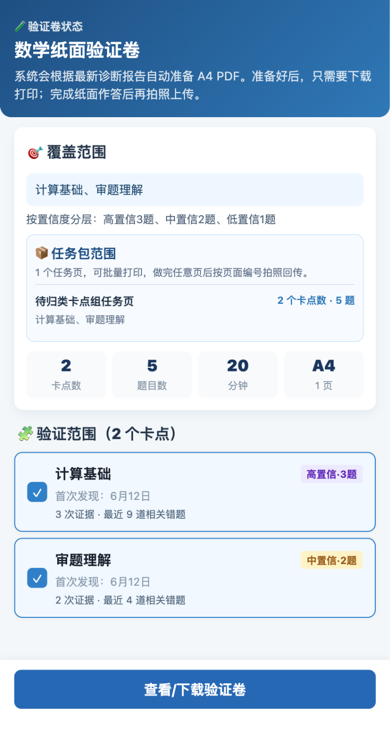
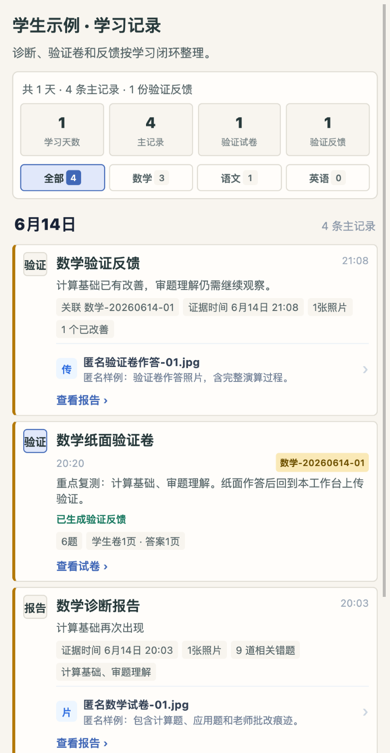
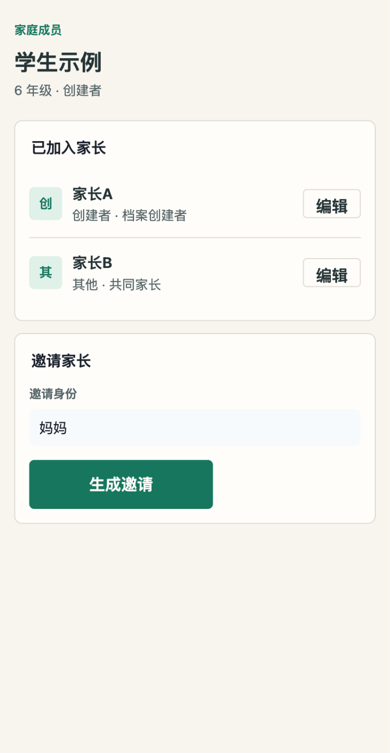

# 学习卡点诊断小程序（Learning Diagnostic Mini Program）

面向家长的 AI 学习诊断工具——拍照上传试卷，自动分析错题并定位学习卡点。

<p align="center">
  
</p>

---

## 项目简介

小学家长在辅导孩子时，往往只能看到"这道题做错了"，却难以判断错误背后的知识卡点是什么、是否已经改善。本项目将此前在电脑端完成的诊断流程（已分析 132 张试卷、80+ 道错题、10 大类卡点）迁移到微信小程序，让家长用手机拍照即可获得结构化的诊断报告。

**目标用户**：小学孩子的家长（主操作者），孩子是被诊断对象。

**核心价值**：
- 拍照即诊断：上传试卷照片，AI 自动识别错题并归类到 10 大卡点体系
- 闭环验证：针对历史卡点生成验证试卷，打印作答后再次上传，对比改善情况
- 零门槛使用：微信内完成全流程，无需注册登录，无需专业知识

---

## 图文使用说明书

> 隐私说明：本文档中的界面截图由自动化脚本使用匿名 mock 数据生成，只展示“学生示例”“孩子A”“家长A”等脱敏信息，不包含真实学生姓名、真实试卷照片、真实诊断报告或任何可识别个人身份的信息。正式使用时，也建议在对外分享截图前遮挡孩子姓名、头像、学校、班级、微信号和原始试卷照片。


### 界面截图版快速上手

#### 第一步：进入家庭学习工作台

多个孩子时，首页会显示家庭学习工作台；只有一个孩子时，会直接进入该孩子的个人学习工作台。家庭页顶部有图示总览卡，每个孩子卡片里的数字、状态、今日行动、学科和快捷入口都可以点击，直接进入对应页面。

<p align="center">
  
</p>

| 你看到的内容 | 怎么操作 |
|--------------|----------|
| 孩子卡片 | 点击卡片主体进入该孩子学习档案 |
| 分析中 / 待验证 / 待上传 / 已改善 | 点击状态块进入对应任务或记录 |
| 数学 / 语文 / 英语 | 点击学科行进入该学科学习工作台 |
| 今日优先行动 | 点击进入当前最需要处理的试卷、验证卷或上传任务 |
| 快捷入口 | 点击最新诊断、当前试卷、知识地图、学习记录 |

#### 第二步：查看孩子学习档案

个人学习工作台是单个孩子的行动页，最重要的是看“今天先做什么”和“最新诊断报告”。这里会显示个人插图入口、今日行动、报告生成时间、证据时间、相关错题数、卡点/知识地图/学习记录入口和三科学科入口。

<p align="center">
  
</p>

| 区域 | 用途 |
|------|------|
| 个人插图 | 点击进入今天的主行动 |
| 今日行动 | 生成验证卷、上传新试卷或查看学习记录 |
| 最新诊断报告 | 查看最近一次 AI 诊断结论、照片数和相关错题数 |
| 接下来可以做什么 | 进入学习卡点、上传新作业、数学知识地图或学习记录 |
| 三科学习入口 | 进入数学、语文、英语的具体工作台 |

#### 第三步：进入学科工作台

学科工作台只回答一个问题：这个学科现在下一步该做什么。常见操作包括拍照诊断、生成验证试卷、查看学习记录、阅读完整报告。

<p align="center">
  
</p>

| 操作入口 | 适合什么时候用 |
|----------|----------------|
| 拍照诊断 | 手上有新的试卷、练习或作业照片 |
| 生成验证试卷 | 已经发现学习卡点，需要复测是否改善 |
| 默认试卷 | 暂时没有现成试卷，希望先用标准题做一次诊断 |
| 学习记录 | 回看诊断报告、验证试卷、作答上传和历史证据 |

#### 第四步：阅读诊断报告

诊断报告是产品的核心价值页。先看标题和摘要，再看学习卡点，最后再展开错题详情。家长不需要先看内部编号，也不需要逐张翻原始照片。

<p align="center">
  
</p>

| 重点 | 判断方式 |
|------|----------|
| 报告是否最新 | 看报告生成时间和证据时间 |
| 结论是否可靠 | 看照片数、相关错题数和本次证据 |
| 先处理什么 | 看高优先级学习卡点 |
| 下一步做什么 | 有待验证卡点时，优先生成验证试卷 |

#### 第五步：生成验证试卷

验证试卷用于确认学习卡点是否真实存在、是否已经改善。当前规则是覆盖待验证细卡点（BN/CHI），按置信度分层出题：高置信 3 题、中置信 2 题、低置信 1 题。

<p align="center">
  
</p>

| 配置项 | 当前规则 |
|--------|----------|
| 选择卡点 | 自动覆盖待验证细卡点；手动兜底最多 80 个目标 |
| 每个目标 | 按置信度 1-3 道题 |
| 题目结构 | 核心验证题为主，高/中置信目标补迁移延展题 |
| 输出格式 | A4 PDF，包含学生卷和答案页 |

#### 第六步：下载、打印并上传验证反馈

每份验证试卷都有唯一编号，例如“数学-20260614-01”。打印给孩子作答后，请回到同一份试卷工作台上传作答照片，避免反馈关联错试卷。

<p align="center">
  
</p>

| 你要做什么 | 点击哪里 |
|------------|----------|
| 看试卷内容 | 查看页面中的试卷内容预览 |
| 打印 | 点击下载 PDF 或分享打印 |
| 完成作答后上传 | 点击“作答完成，上传验证” |
| 查看反馈 | 上传后回到试卷工作台或学习记录查看验证反馈 |

#### 第七步：用学习记录追溯完整证据链

学习记录按时间整理“诊断报告、验证试卷、验证反馈、原始照片/OCR”。主记录优先显示，分析中、失败、照片证据等低频或中间状态会折叠或紧凑展示。

<p align="center">
  
</p>

| 记录类型 | 作用 |
|----------|------|
| 诊断报告 | 说明本次发现了什么学习卡点 |
| 验证试卷 | 记录生成了哪一份试卷、编号是什么 |
| 验证反馈 | 说明哪些卡点改善了，哪些仍需观察 |
| 原始照片/OCR | 作为证据保留，默认不抢占主线 |

#### 第八步：邀请另一位家长共同查看

一个孩子档案可以开放给多个家长。档案创建者可以邀请共同家长；共同家长可以查看资料、上传试卷、生成验证卷和重试分析，但不能管理家庭成员。

<p align="center">
  
</p>

| 角色 | 权限 |
|------|------|
| 档案创建者 | 管理家庭成员、上传、出卷、查看报告 |
| 共同家长 | 上传、出卷、查看报告、重试分析 |
| 未加入家长 | 无法查看孩子学习资料 |

### 1. 一句话理解这个工具

这个小程序不是单纯“讲错题”，而是帮助家长完成一个学习诊断闭环：


家长最终要看的不是“这道题错了”，而是：

- 哪些学习卡点正在影响作答。
- 这些卡点来自多少张试卷、多少道相关错题。
- 最近是否通过验证卷出现改善。
- 下一步应该上传新试卷，还是先复测验证卷。

> **验证卷自动生成**：诊断报告完成后，系统先创建验证卷生成记录；家长点击查看时由前端驱动分批生成，避免云函数超时。验证卷以细卡点（BN/CHI）为出题单位，按置信度生成 1-3 题，并附含解题思路；任一批次失败会标记失败而不是伪装成 ready。

### 2. 第一次使用

| 步骤 | 操作 | 结果 |
|------|------|------|
| 1 | 打开小程序，点击「添加第一个孩子」 | 创建一个孩子的学习档案 |
| 2 | 填写孩子昵称或姓名、年级 | 自动创建数学、语文、英语三科学科档案 |
| 3 | 如果只有一个孩子 | 首页会直接进入该孩子的学习档案 |
| 4 | 如果有多个孩子 | 首页会显示家庭学习工作台，方便切换不同孩子 |

建议录入名称时使用家里容易识别的称呼即可；如果后续需要截图给他人看，优先使用昵称或遮挡真实姓名。

### 3. 上传试卷照片做诊断

| 步骤 | 操作 | 注意事项 |
|------|------|----------|
| 1 | 进入孩子学习档案，选择学科，例如「数学」 | 当前阶段数学链路最完整 |
| 2 | 点击「拍照诊断」 | 可拍照，也可从相册选择 |
| 3 | 一次最多选择 20 张 | 后台会按图片串行异步分析，不需要停留在上传页等待 |
| 4 | 如果是 iPhone HEIF/HEIC 图片 | 小程序会尽量转成 JPEG；无法转换时会提示 |
| 5 | 上传完成后回到学科页或学习记录 | 分析完成后会生成诊断报告 |

拍照建议：

- 试卷尽量铺平，避免折痕遮挡题目。
- 光线均匀，不要有大面积阴影。
- 老师批改痕迹、孩子原始作答、订正内容都尽量拍清楚。
- 如果一张卷子有黑色和蓝色笔迹，系统会按“黑色原始作答、蓝色订正”来辅助判断。

### 4. 阅读诊断报告

诊断报告是产品的核心价值页。报告里重点看四件事：

| 区域 | 看什么 | 怎么理解 |
|------|--------|----------|
| 报告标题 | 本次主要结论和生成时间 | 先判断这份报告是不是最新、是不是本次上传产生的 |
| 证据摘要 | 照片数、相关错题数、证据时间 | 判断结论依据是否足够 |
| 学习卡点 | 例如“计算基础”“审题理解” | 看影响作答的根本问题，不看内部 LP 编号 |
| 错题详情 | 题目、学生答案、根因分析 | 需要复盘时再展开看细节 |

示例口径：

```text
最新数学诊断报告
证据时间：6月14日 20:03
主要发现：计算基础再次出现
本次依据：20 张照片，9 道相关错题
```

这类摘要会尽量在学习档案、学习记录和报告详情中透出，让家长不用层层点击才能知道最新诊断结果。

### 5. 理解“学习卡点”

“学习卡点”是比“错误”“缺陷”更柔和的表达，指孩子在某类题目上反复出现的阻碍点。

| 状态 | 含义 | 建议动作 |
|------|------|----------|
| 待跟进 | 新发现或证据还不够，需要验证 | 生成验证试卷 |
| 持续出现 | 多次诊断中仍然出现 | 优先复测和专项练习 |
| 已改善 | 验证卷中完整作答且通过 | 继续观察一段时间 |
| 复发 | 曾经改善，后来又出现 | 提高优先级，重新验证 |

小程序对家长默认展示文字摘要，例如“计算基础”“审题理解”“分数计算”，不会把内部编号作为主要展示内容。

### 6. 生成验证试卷

当报告发现学习卡点后，可以生成 A4 纸验证试卷。

| 项目 | 当前规则 |
|------|----------|
| 出题对象 | 自动覆盖待验证细卡点；手动兜底最多 80 个目标 |
| 每个目标题量 | 按置信度 1-3 道题 |
| 题目结构 | 核心验证题为主，高/中置信目标补迁移延展题 |
| PDF 内容 | 学生卷 + 答案页 |
| 唯一编号 | 使用“学科 + 日期 + 序号”，例如“数学-20260614-01” |

为什么要有迁移延展题：

- 核心题用于确认当前学习卡点是否还存在。
- 迁移题用于观察孩子能不能举一反三。
- 如果迁移题暴露了新的问题，后续会形成新的学习卡点线索。

### 7. 打印作答并上传反馈

数学题建议保留纸笔作答过程，因为中间演算过程本身就是重要证据。


上传作答卷时，请回到对应编号的验证试卷工作台。例如看到纸面编号是“数学-20260614-01”，就回到同一份试卷页面上传，避免把反馈关联到错误试卷。

### 8. 查看学习记录

学习记录按时间线整理所有证据：

| 记录类型 | 展示内容 | 是否主记录 |
|----------|----------|------------|
| 诊断报告 | 结论摘要、卡点、照片数、错题数 | 是 |
| 验证试卷 | 试卷编号、题量、覆盖卡点、上传状态 | 是 |
| 验证反馈 | 是否改善、关联试卷编号 | 是 |
| 原始照片/OCR | 原图、识别摘要、疑似重复 | 折叠为证据 |
| 分析中/失败 | 中间状态或异常状态 | 紧凑显示，可重试 |

学习记录的目标不是堆列表，而是保留“上传了什么 → 得到什么结论 → 做了哪份验证卷 → 是否改善”的证据链。

### 9. 多孩子和共同家长

| 场景 | 使用方式 |
|------|----------|
| 一个孩子 | 打开首页后直接进入该孩子学习档案 |
| 两到三个孩子 | 首页显示家庭学习工作台，每个孩子一张高密度卡片 |
| 另一个家长也要看 | owner 在家长管理里生成邀请，对方扫码或输入邀请码加入 |
| 共同家长权限 | 可以查看、上传、生成试卷、重试分析；不能管理家庭成员 |

这样设计是为了适应真实家庭：孩子数量通常不多，但多个家长可能都需要看同一份学习资料。

### 10. 隐私与安全注意事项

- README 和项目文档不得放真实学生姓名、学校、班级、微信号、原始试卷照片。
- 对外演示截图请使用匿名孩子名，例如“孩子A”“学生示例”。
- 真机测试中产生的真实报告不要提交到 Git。
- 上传到云端的学习数据通过 openID 和家庭成员权限隔离。
- 邀请共同家长时，只向可信微信账号分享邀请链接或邀请码。

---

## 功能特性

### 已实现

- ✅ 学生管理：添加/选择学生，每人独立档案
- ✅ 家庭学习工作台：0 个孩子显示空态，1 个孩子直接进入个人学习工作台，多个孩子显示带图示总览的高密度家庭工作台
- ✅ 家长共享：孩子档案支持 owner / viewer 家长成员，共同家长除家庭成员管理外可查看、上传、生成试卷和重试分析
- ✅ 个人学习工作台：个人插图、今日行动、最新诊断报告、行动队列和三科学科入口均可点击操作
- ✅ 学习卡点透出：首页展示当前高优先级卡点，支持进入卡点中心和单卡点工作台
- ✅ 学习卡点中心：按学科和状态筛选待验证、持续出现、复发和已改善卡点
- ✅ 学科工作台：数学/语文/英语三科独立，学科页只承载待处理队列、主任务和工具入口
- ✅ 拍照诊断：支持最多 20 张照片批量上传，HEIF 自动转 JPEG 或给出可读提示，后台按图片串行异步分析
- ✅ 诊断报告：卡点排行条形图 + 错题详情折叠列表 + 改善状态标注
- ✅ 验证试卷出卷配置：基于待验证细卡点生成任务包，按置信度 1-3 题分层出题，生成 A4 PDF 下载打印
- ✅ 默认诊断试卷：按年级动态生成标准诊断卷（1-6 年级 A/B 卷），无需预存题库
- ✅ 试卷预览与打印：A4 预览 + PDF 下载 + 分享打印
- ✅ 试卷下载状态：同一份 PDF 下载后显示「已下载」，避免重复下载
- ✅ 学习记录：按天整理诊断报告、验证试卷、验证作答上传和原始照片，形成学习证据链
- ✅ 照片去重：跨批次 + 跨历史报告的 OCR 指纹比对，避免重复计入
- ✅ AI 结果标准化：字段截断、严重度归一、结构化校验
- ✅ 验证报告对比：标注改善 / 加重 / 新增 / 持续四种状态
- ✅ 分析进度轮询：学科主页和报告页每 10s 轮询，支持手动重试
- ✅ 报告 PDF 生成与下载
- ✅ 英语学科：工作台 + 单词熟悉度练习 + AI 语音判定 + 纸面听写 + OCR 批改 + 学习记录证据链
- ✅ 英语词库管理：PEP 个人词库种子、批量导入、熟悉度和拼写双维度进度追踪
- ✅ Skill / CLI P0：封装诊断、报告、卡点、验证卷、反馈和时间线能力，提供 `ldx` 本地 CLI 合同测试
- ✅ 数据归属校验：openID 隔离 + 参数白名单
- ✅ 自动化测试：353 个常规用例通过，JS 语法检查 121 文件通过，测试套件 < 2s

### 待完善

- ⚠️ 微信订阅消息推送（`sendNotification` 当前为空实现，待申请模板）
- ✅ 上传与分析解耦：创建报告后服务端 fire-and-forget 启动分析，客户端提交后即可返回
- ⚠️ 默认试卷跨学生共享模板（当前仅同学生复用）
- ⬜ 真机端到端验收

---

## 技术栈

| 层级 | 技术 | 说明 |
|------|------|------|
| 前端 | 微信小程序原生 | WXML / WXSS / JS，不使用第三方框架 |
| 后端 | 微信云开发 (CloudBase) | 云函数 + 云数据库 + 云存储，零服务器 |
| AI（图像） | CloudBase AI `hy3-preview` | 腾讯云混元视觉模型，多模态图片分析 |
| AI（文本） | CloudBase AI `deepseek-v4-flash` | 用于生成试卷题目 |
| 数据库 | 云开发 MongoDB 兼容数据库 | 11 个核心集合：students / subjectProfiles / reports / papers / analysisTasks / studentMembers / studentInvites / reportFeedback / englishImportBatches / studentEnglishWords / englishPracticeSessions |
| PDF 生成 | pdfkit | 云函数内生成 A4 试卷/报告 PDF |
| 测试 | Node.js 内置 test runner | `node --test`，无外部测试框架依赖 |

---

## 目录结构

```
miniprogram-learning-diagnostic/
├── miniprogram/                 # 小程序前端
│   ├── app.js / app.json        # 全局入口与配置（16 个页面路由）
│   ├── utils/                   # cloud.js（数据访问层）、poller.js（轮询器）、util.js
│   └── pages/                   # 16 个页面（index / student-profile / add-student /
│                                #   subject-select / subject-home / upload / upload-history /
│                                #   parent-management / join-student / report /
│                                #   bottleneck-center / bottleneck-detail / english-practice /
│                                #   english-dictation / generate-verification /
│                                #   default-paper / paper-preview）
├── cloudfunctions/              # 云函数后端（10 个）
│   ├── uploadAndAnalyze/        #   入口：校验 → 创建报告 → 触发分析
│   ├── analyzePhotos/           #   主控：分批 → 串行分析 → 去重 → 合并 → 对比
│   ├── analyzeBatch/            #   单批次 AI 分析 + 结果标准化
│   ├── getAnalysisProgress/     #   轻量进度查询
│   ├── studentAccess/           #   家长成员、邀请和加入管理
│   ├── studentData/             #   访问感知的学习资料聚合读取
│   ├── reportFeedback/          #   家长反馈和复核线索
│   ├── englishVocabulary/       #   英语个人词库、熟悉度练习和纸面听写
│   ├── generatePaper/           #   生成验证/默认试卷 + A4 PDF（双栏布局+解题思路）
│   ├── generateReportPDF/       #   生成报告 PDF
│   └── analyzePhotos/           #   照片分析主流程 + auto-verification.js（验证卷自动生成）
├── services/skills/             # P0 Skill 能力内核
├── cli/ldx.js                   # 本地 CLI 入口
├── tests/                       # 单元自动化测试（545 个用例 + 真实图片 E2E 脚本）
├── scripts/                     # check-js.js、preview-pdf.js（PDF预览）、DevTools E2E、指标导出
├── docs/                        # 补充文档
├── PRD.md                       # 产品设计文档
├── PROJECT_PLAN.md              # 技术架构与开发计划
├── SETUP.md                     # 部署指南
└── package.json                 # npm scripts
```

---

## 快速开始

### 环境要求

- [微信开发者工具](https://developers.weixin.qq.com/miniprogram/dev/devtools/download.html)（最新稳定版）
- Node.js ≥ 18（运行测试和语法检查）
- 微信云开发环境（已在 `project.config.json` 中配置 `cloudbaseRoot`）

### 克隆与打开

```bash
git clone <repo-url>
cd miniprogram-learning-diagnostic
```

用微信开发者工具打开项目根目录，等待编译完成。

### 部署云函数

1. 在云开发控制台开通 `hy3-preview` 和 `deepseek-v4-flash` 两个 AI 模型
2. 对 `cloudfunctions/` 下每个云函数目录右键 → "上传并部署：云端安装依赖"
3. 云函数执行超时保持在微信平台允许的 **60 秒以内**；`uploadAndAnalyze` 负责快速创建报告并启动后台分析，长耗时场景通过进度轮询和手动重试恢复
4. `generatePaper` 和 `generateReportPDF` 已内置 Noto 中文字体，不需要配置 `FONT_FILE_ID`

### 配置数据库

在云开发控制台创建以下集合，安全规则设为 `doc._openid == auth.openid`：

- `students`
- `subjectProfiles`
- `reports`
- `papers`
- `analysisTasks`
- `studentMembers`
- `studentInvites`
- `reportFeedback`
- `englishImportBatches`
- `studentEnglishWords`
- `englishPracticeSessions`

详细步骤参见 [SETUP.md](./SETUP.md)。

---

## 测试

本项目测试体系分为两大类：本地可重复的**单元自动化测试**，以及通过微信开发者工具 CLI 驱动的**页面级 E2E 测试**。单元层全部基于 Node.js 内置 runner（`node --test`），零第三方测试框架依赖。

| 类别 | 说明 | 命令 |
|------|------|------|
| **单元自动化测试** | 545 个离线用例：云函数、Presenter、工具、数据层、合同、知识库一致性和诊断回归 | `npm run test:unit` 或 `npm test` |
| **CLI E2E 核心页** | 微信开发者工具 CLI 驱动 17 页面和基础跨页流程 | `npm run test:e2e:core` |
| **CLI E2E 数学** | 数学数据驱动场景、细卡点、知识地图和学习资源链路 | `npm run test:e2e:math` |
| **CLI E2E 语文** | 语文工作台、诊断报告、错项复测出卷轻量链路 | `npm run test:e2e:chinese` |
| **CLI E2E 英语** | 英语工作台、词库、熟悉度、纸面听写和学习记录 | `npm run test:e2e:english` |
| **真实数据/真实图片** | 真实学生数据页面烟测、真实图片诊断、真实云函数可用性 | `npm run test:e2e:real-data` / `npm run test:e2e:real-image` / `npm run test:e2e:real-cloud` |

```bash
# 日常开发：运行全部单元自动化测试
npm test

# 带覆盖率报告（行/函数 80% 门槛）
npm run test:coverage

# 完整本地验证（单元自动化 + JS 语法检查）
npm run verify

# PDF 格式本地预览（不用上传云函数）
node scripts/preview-pdf.js
open tmp/preview-verification.pdf

# CLI E2E（需先打开微信开发者工具并开启服务端口）
npm run test:e2e:doctor       # 环境探测
npm run test:e2e:core         # 17 页面核心回归
npm run test:e2e:math         # 数学专项 E2E（当前最完整）
npm run test:e2e:chinese      # 语文轻量专项 E2E
npm run test:e2e:english      # 英语专项 E2E
npm run test:e2e:all           # 聚合所有 E2E + 报告

# 发布前
npm run release:check          # 部署 + 全测试 + 覆盖率
```

> 完整测试框架设计见 [docs/TEST_FRAMEWORK_DESIGN.md](./docs/TEST_FRAMEWORK_DESIGN.md)，本次 V2 计划见 [docs/TEST_STRATEGY_V2.md](./docs/TEST_STRATEGY_V2.md)。

---

## 项目文档索引

| 文档 | 说明 |
|------|------|
| [PRD.md](./PRD.md) | 产品设计文档 v2.9：多孩子工作台、学习档案、卡点透出体系、英语个人词库听写、页面职责边界、异步架构、学习记录、实现状态总览 |
| [PROJECT_PLAN.md](./PROJECT_PLAN.md) | 技术架构、目录结构、AI 分析流程、部署步骤、版本规划 |
| [SETUP.md](./SETUP.md) | 部署指南：环境配置、云函数部署、字体配置、数据库索引、真机验收 |
| [docs/SKILL_AND_CLI_DESIGN.md](./docs/SKILL_AND_CLI_DESIGN.md) | Skill / CLI 设计与 P0 实现说明 |
| [docs/METRICS.md](./docs/METRICS.md) | 单个孩子运营指标：分析完成率、报告质量、验证通过率、反馈率和周趋势 |
| [docs/RELEASE_CHECKLIST.md](./docs/RELEASE_CHECKLIST.md) | 发布门禁、云函数部署核对、真实数据烟测和回滚流程 |
| [docs/TEST_MATRIX.md](./docs/TEST_MATRIX.md) | 测试矩阵与验收清单 |
| [docs/TEST_FRAMEWORK_DESIGN.md](./docs/TEST_FRAMEWORK_DESIGN.md) | 测试框架 V2 设计：单元自动化测试 + CLI E2E 分学科测试 |
| [docs/CLOUD_FUNCTIONS.md](./docs/CLOUD_FUNCTIONS.md) | 云函数 API 参考（入参/出参/错误处理/依赖关系） |
| [CHANGELOG.md](./CHANGELOG.md) | 版本变更记录 |

---

## License

[Apache License 2.0](./LICENSE)
