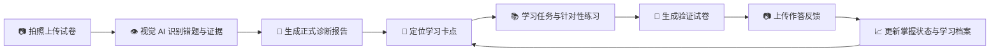
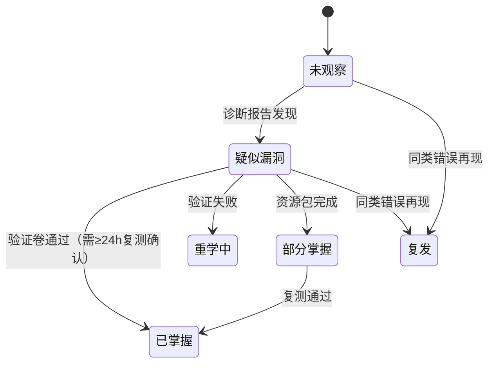
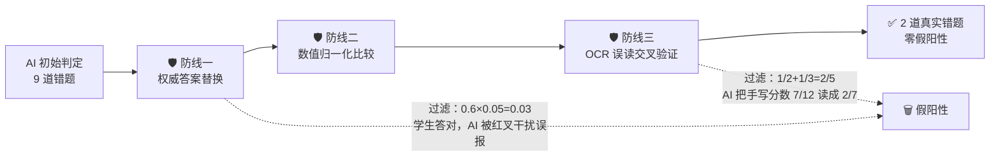
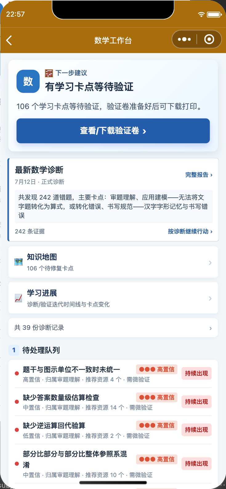
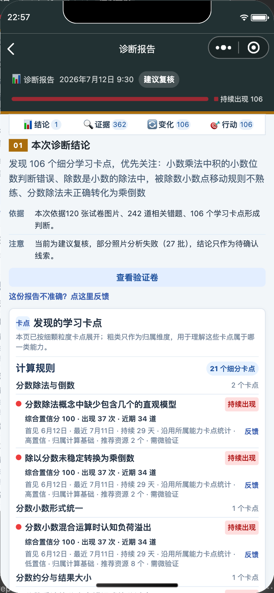
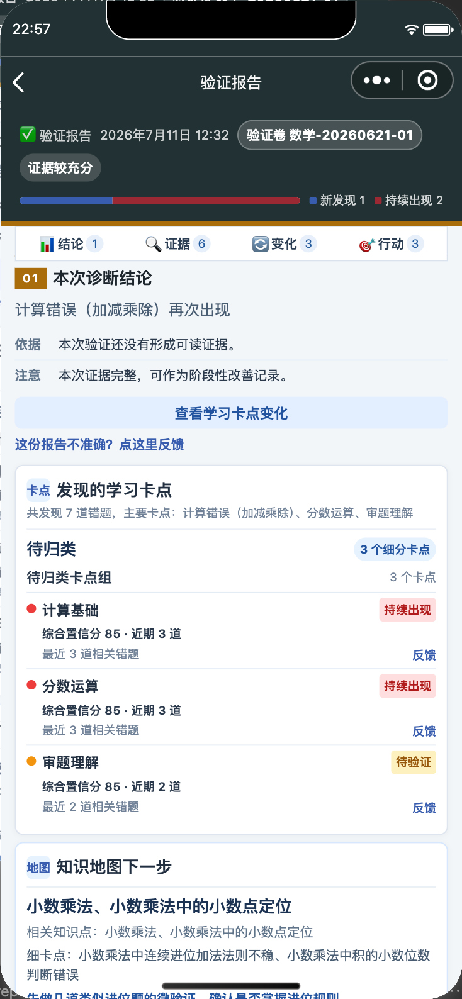
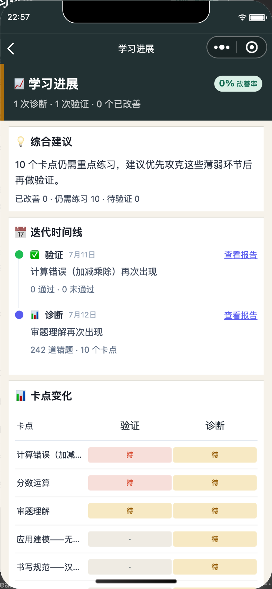
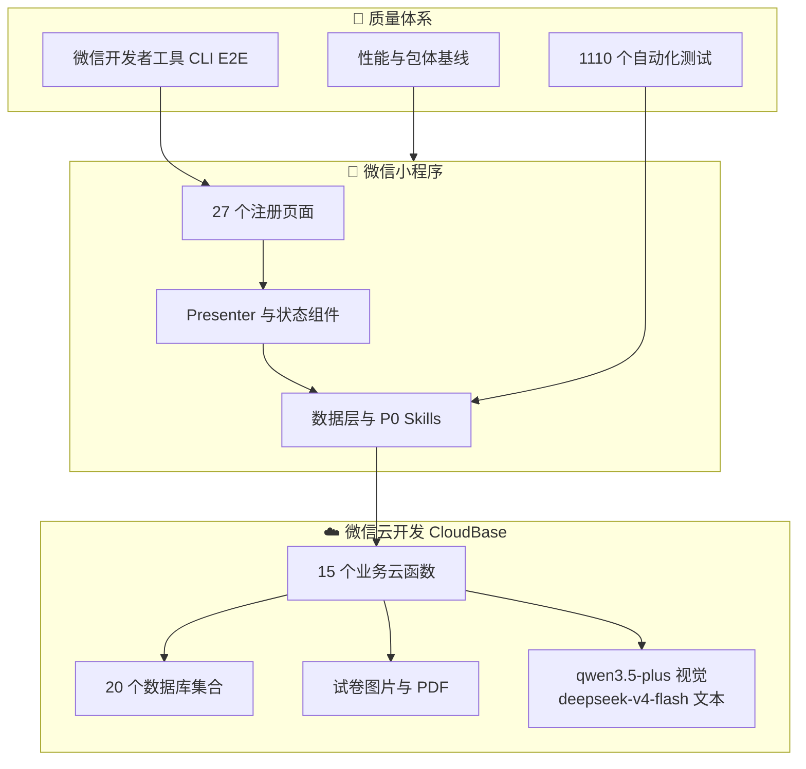

# 学习卡点诊断小程序

<p align="center">
  
</p>

<p align="center">
  <strong>把"这道题做错了"，变成家长看得懂、孩子做得到、结果可验证的下一步行动。</strong>
</p>

<p align="center">
  面向小学家庭的 AI 学习诊断微信小程序。拍照上传试卷后，系统用视觉 AI 定位学习卡点、生成正式诊断报告，<br />
  再把学习任务、验证试卷和作答反馈串成一条持续改善闭环。
</p>

<p align="center">
  
  
  
  
  
</p>

<p align="center">
  
  
  
</p>

> 以上截图由自动化脚本使用匿名 mock 数据生成，不含真实学生资料。更多界面见[图文用户导览](docs/user-guide/README.md)。

---

## ✨ 项目速览

| 📷 诊断照片 | ✏️ 识别错题 | 🎯 学习卡点 | 🛡 验证假阳性 | 🗺 数学知识节点 | ✅ 自动化测试 |
| ---: | ---: | ---: | ---: | ---: | ---: |
| **120 张** | **242 道** | **10 个** | **0** | **150 个** | **1110 个** |

产品不止给出一份报告，而是把家长的三个疑问变成一套可追踪的流程：



1. **现在发生了什么** —— 哪些错误重复出现，证据来自哪里，结论可信到什么程度。
2. **接下来做什么** —— 优先处理哪个卡点，学习、练习和复测如何衔接。
3. **是否真的改善** —— 验证结果如何，哪些问题已经改善，哪些仍需观察或再次处理。

---

## 📱 界面全景

### 家庭学习中心

家庭首页按孩子组织信息，把最重要的动作提前：快捷入口、每门学科的最新正式诊断、优先行动、四项学习统计和紧凑学科状态。支持 owner 邀请共同家长协作，成员管理仅限 owner。

| | | |
| --- | --- | --- |
| <br /><b>01 家庭学习工作台</b><br />多孩子行动总览，优先行动前置 | <br /><b>02 个人学习档案</b><br />单孩子个人工作台 | <br /><b>07 学习记录</b><br />按天聚合的诊断与验证时间线 |
| <br /><b>08 家长成员管理</b><br />owner / 共同家长权限 | <br /><b>04 诊断报告</b><br />卡点排行 + 验证反馈卡片 | <br /><b>03 数学工作台</b><br />最新诊断与待验证队列 |

### 诊断 → 验证 → 反馈迭代闭环

报告页展示完整迭代过程：诊断结论、验证反馈（改善/仍需练习）、卡点状态变化、下一步行动建议。不是一份静态报告，而是持续追踪学习进展的动态档案。

| | | |
| --- | --- | --- |
| <br /><b>05 验证卷生成</b><br />按卡点出卷的配置器 | <br /><b>06 验证卷预览</b><br />A4 PDF 打印预览 | <br /><b>验证反馈卡片</b><br />`已验证 X 个卡点：Y 改善 / Z 待练习` |

**学习进展页**提供完整迭代历史：纵向时间线 + 卡点变化矩阵（每行一个卡点，每列一个轮次，直观展示状态流转）。

---

## 🧮 数学：最深的一条诊断闭环

数学从照片诊断到掌握确认全链路落地，核心是**节点掌握六态状态机**——掌握与否不由诊断置信度宣告，而由验证事件驱动：



配套基础设施：

| 设施 | 规模 | 作用 |
| --- | --- | --- |
| 知识地图 | **150 个知识节点** × 四领域 × 1-6 年级 | AI 判定必须落在标准目录内，五层归并保证历史可比 |
| 细卡点库 | **40 个标准细卡点**（BN） | 定位与出题的最小单位，展示层聚合为 10 个粗卡点 |
| 干预会话 | 24h / 72h 复测调度 | 首页行动队列自动置顶"到期复测" |

---

## 🤖 AI 如何做到可信

### 模型选型

| 模型 | 用途 | 调用方式 |
| --- | --- | --- |
| **qwen3.5-plus** | 多模态视觉识别（图片分析） | `enable_thinking: false` 关闭深度思考，单张图 ~15s |
| **deepseek-v4-flash** | 文本生成（题目、学习资源） | 纯文本，不处理图片 |

> ⚠️ **历史教训（模型选型铁律）**：项目最初用 `hy3-preview` 做图片分析，但它是纯文本模型（CloudBase [官方文档](https://docs.cloudbase.net/ai/model/multimodal)明确列为不支持图片），传图被静默忽略，AI 只从 prompt 脑补题目和答案，**所有分析结果不可信**。2026-07-11 修复为 qwen3.5-plus。铁律：图片分析必须使用真正的多模态视觉模型。

### 验证分析三层防线（零假阳性的来源）

验证卷模式下，AI 对"学生答案对错"的判定**不直接采信**，必须经过确定性后处理：



| AI 初始报告 | 三层防线处理后 | 说明 |
| --- | --- | --- |
| 9 道错题 | **2 道真实错题** | 权威答案替换 + 数值归一化 + OCR 交叉验证 |
| 2.7×3.8=11.26（应 10.26） | ✓ 保留 | 真实错题（进位错误） |
| 3.2m×45cm=144m²（应 1.44m²） | ✓ 保留 | 真实错题（单位未统一） |
| 0.6×0.05=0.03（标答 0.03） | ✗ 已过滤 | 答案正确，AI 误报（红叉干扰） |
| 1/2+1/3=2/5（AI 读成 2/7） | ✗ 已过滤 | 学生写对，AI 读错手写分数 |

详见 [CLAUDE.md](CLAUDE.md) 的"AI 视觉模型架构"章节。

---

## 📊 真实运行数据（内测，已脱敏）

以下截图来自真实内测流程（画面经确认不含姓名、头像等身份信息），数据截至 2026-07-12：

<p align="center">
  
  
  
  
</p>

| 指标 | 数据 |
| --- | --- |
| 累计诊断图片 | **120 张**（去重后纳入分析） |
| 单次综合诊断报告 | 基于 120 张试卷照片，识别 **242 道错题**，定位 **10 个学习卡点** |
| 验证卷 | 生成 **70 道针对性验证题**，覆盖 69 个细粒度卡点 |
| 验证卷答题分析 | 上传 4 张答题照片，精准识别 **2 道真实错题**，零假阳性 |
| AI 用量追踪 | 每次调用记录 token 数和估算成本，按月汇总 |

**诊断报告卡点分布**（120 张数学试卷照片的综合结果）：

| 学习卡点 | 错题数 | 严重度 |
| --- | ---: | --- |
| 审题理解 | 51 | 高 |
| 应用建模 | 45 | 高 |
| 书写规范 | 40 | 高 |
| 计算基础 | 34 | 高 |
| 几何概念 | 32 | 中 |
| 小数百分数 | 19 | 中 |
| 分数运算 | 15 | 中 |
| 符号理解 | 7 | 低 |
| 抄写检查 | 4 | 低 |
| 单位换算 | 2 | 低 |

---

## 📚 三个学科，三种诊断逻辑

同一套闭环不机械套用到所有学科——每科保留独立的证据模型和行动方式：

| 学科 | 诊断重点 | 下一步行动 | 验证方式 |
| --- | --- | --- | --- |
| **🧮 数学** | 知识节点、细粒度卡点、频次与置信度 | 知识地图、任务包、同类题迁移练习 | 围绕同一卡点生成新的相似题，验证举一反三 |
| **📖 语文** | 具体错字、错词、读音、释义等记忆型错项 | 原项复习优先，再补充同音/形近迁移 | 原来识别错误的字词必须再次入卷 + 有限迁移题 |
| **🔤 英语** | "会认"和"会写"两条独立掌握状态 | 今日词汇、认词练习、纸面听写、错词本 | 口头识别与纸面拼写分别取证、分别更新 |

| | | |
| --- | --- | --- |
| <br /><b>数学工作台</b><br />诊断、知识地图、复测调度 | <br /><b>09 语文工作台</b><br />错项一错一追踪 | <br /><b>12 英语工作台</b><br />词汇双维闭环 |

| | | |
| --- | --- | --- |
| <br /><b>10 语文错项详情</b><br />原项复测 + 有限迁移 | <br /><b>11 语文技能任务</b><br />能力型微任务 | <br /><b>13 英语易混词</b><br />易混词巩固 |

英语纸面听写由 TTS 按语音节奏读词、支持语音指令（开始/重读/暂停/继续/下一个），完成后拍照 OCR 批改——"会认"（ASR 语音识别）与"会写"（听写拼写）分别留证据。错词本按五类聚合：

<p align="center">
  
</p>

更多学科规则见[学科设计索引](docs/subject-design/README.md)。

---

## 🏗️ 工程架构



| 层级 | 主要技术 |
| --- | --- |
| 客户端 | 微信小程序原生 WXML / WXSS / JavaScript，按需注入与 17 个独立分包 |
| 云端 | 微信云开发 CloudBase，15 个业务云函数、云数据库、云存储 |
| AI | `qwen3.5-plus` 多模态视觉识别 + `deepseek-v4-flash` 题目与内容生成 |
| 文档与 PDF | pdfkit、内置 Noto CJK 字体、结构化报告与验证卷 |
| 测试 | Node.js `node:test`、自研页面 harness、`miniprogram-automator` CLI E2E |
| 评测 | `evaluation/diagnostic-accuracy/` 三科诊断准确性基准（在建） |

详细设计见[系统架构](docs/ARCHITECTURE.md)、[云函数 API](docs/CLOUD_FUNCTIONS.md)和[数据字典](docs/DATA_DICTIONARY.md)。

## 项目结构

```text
miniprogram-learning-diagnostic/
├── miniprogram/              # 小程序页面、组件、服务和本地数据（27 页面）
├── cloudfunctions/           # 15 个业务云函数与共享模板
├── evaluation/               # 诊断准确性评测基础设施（三科基准，在建）
├── data/                     # 150 个数学知识节点、40 个细卡点、脱敏示例数据
├── scripts/                  # 构建、校验、性能、截图和 DevTools E2E
├── tests/                    # 103 个测试文件（默认离线集 1110 个测试）
├── docs/                     # 产品、学科、架构、质量与图文文档
├── database/                 # 数据库索引声明
├── README.md                 # GitHub 项目主页
├── PRD.md                    # 当前产品需求基线
├── CLAUDE.md                 # AI 编码助手约定（含 AI 视觉模型架构）
└── SETUP.md                  # 本地与云开发配置
```

## 🚀 快速开始

**环境要求**：Node.js 18+、npm、微信开发者工具、已开通云开发的微信小程序账号。

```bash
git clone <repository-url>
cd miniprogram-learning-diagnostic
npm install
npm run verify          # 1110 个自动化测试 + 351 个 JS 文件语法检查
npm run check:size      # 主包体积预算检查
```

使用微信开发者工具导入项目根目录，确认 `project.config.json` 中的 AppID 和云开发环境配置，再按[部署指南](SETUP.md)创建集合、索引并部署云函数。

```bash
npm test                    # 1110 个常规自动化测试
npm run check               # 检查 351 个 JavaScript 文件
npm run test:coverage       # 覆盖率门禁（80% 行/函数）
npm run release:check       # 发布前全量门禁
npm run test:e2e:doctor     # 检查微信开发者工具 CLI 环境
npm run test:e2e:all        # 主要页面与学科 CLI E2E
```

真实云环境、真实图片和真机测试默认与离线测试隔离，避免误调用 AI 或写入真实数据。完整说明见[测试指南](docs/quality/TESTING.md)。

## 🎯 当前质量基线

以下数字为 2026-09-12 当前工作区验证结果：

| 指标 | 当前结果 | 复现命令 |
| --- | ---: | --- |
| 常规自动化测试 | **1110 / 1110 通过** | `npm test` |
| JavaScript 语法检查 | 351 个文件通过 | `npm run check` |
| 主包体积 | **810 KB / 1200 KB**（剩余 390 KB） | `npm run check:size` |
| 注册页面 | 27 | `miniprogram/app.json` |
| 业务云函数 | 15 | `cloudfunctions/`，不含 `_shared-templates` |
| 测试文件 | 103 个 | `tests/` |
| 数据库集合 | 20 | `docs/DATA_DICTIONARY.md` |
| 数学知识节点 | 150 | `data/math/knowledge-nodes.seed.json` |
| 标准细卡点 | 40 | `cloudfunctions/analyzeBatch/taxonomy-bn-list.js` |

新增大体积资源应优先评估分包，不得突破微信平台 2 MB 主包限制。发布门禁、真实数据烟测和回滚流程见[发布清单](docs/quality/RELEASE_CHECKLIST.md)。

## 📖 文档导航

| 想了解什么 | 从这里开始 |
| --- | --- |
| 产品定位与当前范围 | [PRD](PRD.md) · [产品文档索引](docs/product/README.md) |
| 看图了解完整使用流程 | [图文用户导览](docs/user-guide/README.md) |
| 数学、语文、英语为什么不同 | [学科设计索引](docs/subject-design/README.md) |
| AI 视觉模型架构与三层防线 | [CLAUDE.md](CLAUDE.md) "AI 视觉模型架构"章节 |
| 前后端如何协作 | [系统架构](docs/ARCHITECTURE.md) · [云函数 API](docs/CLOUD_FUNCTIONS.md) |
| 数据存在哪里 | [数据字典](docs/DATA_DICTIONARY.md) |
| 如何配置和部署 | [部署指南](SETUP.md) · [部署与烟测](docs/DEPLOYMENT.md) |
| 如何测试和发布 | [测试指南](docs/quality/TESTING.md) · [测试矩阵](docs/quality/TEST_MATRIX.md) · [发布清单](docs/quality/RELEASE_CHECKLIST.md) |
| 遇到问题如何处理 | [故障排查](docs/quality/TROUBLESHOOTING.md) |
| 全部当前文档与历史资料 | [文档中心](docs/README.md) |

## 🔒 隐私与数据边界

本仓库只包含脱敏示例、结构化种子数据、匿名截图和实现文档。真实孩子姓名、学校、班级、账号、试卷原图、诊断报告、PDF 输出和任何可识别个人身份的数据不得提交到 GitHub。对外分享截图前应再次检查头像、姓名、原始作答和云文件信息。

## 📌 项目状态

当前项目处于**私有内测和持续迭代阶段**。数学诊断、微验证与节点掌握六态闭环，语文具体错项复测，以及英语词汇双维闭环均已落地；三科诊断准确性评测基础设施已合入（[evaluation/](evaluation/diagnostic-accuracy/)，在建）。订阅消息发送链路尚未实现，将在发布收口后单独设计。

项目的重要变化记录在 [CHANGELOG](CHANGELOG.md)。

## License

Private project. All rights reserved.
