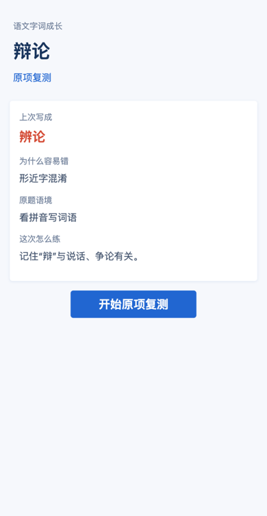
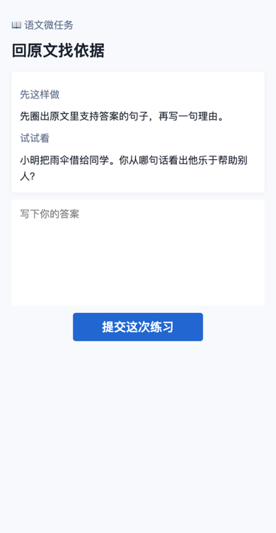
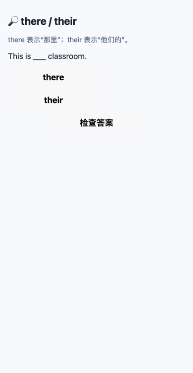
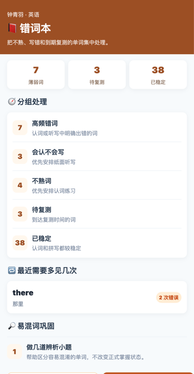

# 图文用户导览

这是一份面向家长的快速图文导览。所有图片均由自动化脚本使用脱敏模拟数据生成：不含真实孩子姓名、学校、账号、原始试卷照片、文件地址或内部编码。

## 先看现在最重要的事

  
  

家庭工作台把每个孩子的待办、改善、最新正式诊断和下一步行动放在一起；学习记录则把诊断、验证卷和反馈按时间串起来。家长可以先处理优先行动，再回到记录查看依据。

## 从诊断到改善

  
  
  

1. 拍照上传试卷后，先阅读正式诊断报告，确认哪些学习卡点最值得处理。
2. 为需要复测的卡点生成验证试卷，打印给孩子完成。
3. 上传作答照片后，系统会把反馈写回学习记录，呈现改善、持续出现或需要继续观察的结论。

## 三个常用入口

  
  
  

| 页面 | 适合什么时候打开 |
|---|---|
| 学习档案 | 想了解一个孩子整体的学习状态和今天的主行动。 |
| 学科工作台 | 想只处理数学、语文或英语当前的一项学习任务。 |
| 家长管理 | 想邀请另一位家长共同查看学习资料。 |

完整操作说明请回到项目 [README](../../README.md) 的“图文使用说明书”。

## 语文和英语的今日任务

  
  
  
  
  
  

语文先复测真实写错的字词，再在没有待复测错项时完成短小的阅读表达任务。英语把“会认”和“会拼”分开安排，易混词辨析只是辅助巩固，不会替代听写或认词记录。
